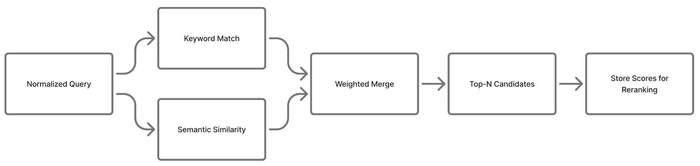
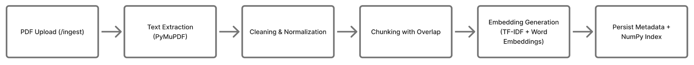
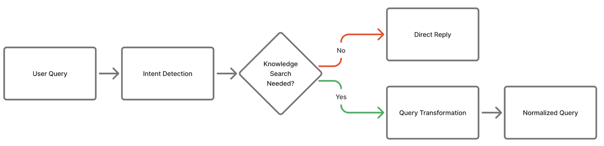
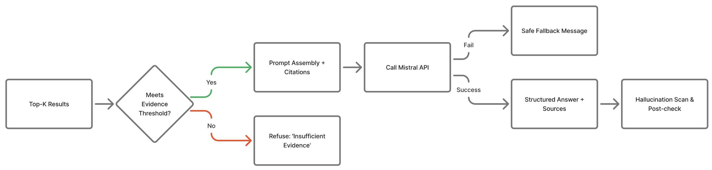

# RAG Backend System 

A Python backend for a Retrieval‑Augmented Generation (RAG) pipeline using FastAPI and the Mistral AI API. This project ingests PDF files, performs hybrid retrieval without external RAG frameworks or vector databases, and generates grounded answers with citations. The design emphasizes clarity, explicit tradeoffs, and from‑scratch retrieval components.

## System Design

This system enables you to upload PDF documents, query them in natural language, and receive answers supported by relevant chunks from those documents. It consists of:

1) Data Ingestion: PDF upload, text extraction, cleaning, chunking, embedding, and persistence
2) Query Processing: intent detection and query transformation
3) Semantic Search: hybrid matching combining semantic similarity and keyword overlap
4) Reranking: multi‑stage filtering, diversity, and optional LLM‑based reranking
5) Generation: prompt assembly and answer generation with citations
6) UI: minimal, responsive interface for uploads and chat

Each component below handles a distinct stage of the retrieval-augmented generation pipeline, ensuring modularity, clarity, and ease of testing.

## Component Details

### 1. Data Ingestion

Files: `app/ingestion.py`, `app/utils_text.py`, `app/embeddings.py`, `app/store.py`

Flow:
- Upload one or more PDF files to `POST /ingest` (see `app/main.py`).
- Extract text using PyMuPDF (fitz).
- Clean text by condensing whitespace for stable chunking (`clean_text`).
- Chunk the document into overlapping character windows to preserve local context (`chunk_text`).
- Fit custom embeddings and generate vectors (`EmbeddingGenerator`).
- Persist:
  - Chunks and metadata to `data/chunks_metadata.json`
  - Embeddings as a NumPy array to `data/vector_index.npy`

Chunking considerations:
- Character‑based chunking avoids dependency on model tokenizers and is robust to noisy PDF text.
- Overlap reduces the risk of splitting related facts across boundaries.
- Each chunk includes filename and positional metadata for traceability and citation.



### 2. Query Processing

File: `app/query.py`

Objectives:
- Detect whether a query warrants knowledge‑base search (avoid searching on greetings or pleasantries).
- Transform queries into retrieval‑friendly forms to improve recall.

Implemented elements:
- Lightweight intent classifier with categories such as greeting, clarification, list, comparison, timeline, skills, experience, education, contact, kb.
- Query normalization and pattern‑guided transformations (for example "what is X" becomes "X definition explanation information").



### 3. Semantic Search (Hybrid)

Files: `app/embeddings.py`, `app/query.py`

Signals:
- Semantic similarity via custom TF‑IDF features and lightweight word embeddings (cosine similarity).
- Keyword evidence via token overlap and TF‑IDF features.

Combination:
- A weighted hybrid score combines semantic and keyword evidence. Weights are configurable in `constants.py`.
- The final retrieval score = α × semantic_similarity + (1 − α) × keyword_overlap, where α is configurable (default: 0.6 in constants.py).

Storage model:
- No external vector database. Embeddings are stored as a NumPy array on disk for simplicity and assignment compliance.
- Embeddings are serialized with NumPy for fast disk I/O and deterministic retrieval between sessions.



### 4. Reranking and Post‑processing

File: `app/query.py`, optional `app/reranker.py`

Multi‑stage strategy:
- Retrieve broadly (configurable candidate count) to avoid early misses.
- Post‑process with diversity‑aware selection to reduce redundancy.
- Optional LLM‑based reranking (`LLMReranker`) to refine the final order under tight top‑k.
- Evidence thresholding: if top results do not meet minimal support, respond with "insufficient evidence" guidance instead of hallucinating.

Reranking details:
- The LLM-based reranker (LLMReranker) can be toggled in constants.py to balance latency and precision.
- Redundant chunks from the same region of a document are deprioritized to improve information diversity.


### 5. Generation

File: `app/query.py`

Process:
- Assemble a prompt using the final top‑k chunks and the user's question.
- Call the Mistral API with conservative temperature settings for stable outputs.
- Answer shaping: select templates based on intent (lists, comparisons, timelines) for structured responses.
- Return citations for transparency and accountability.
- Post‑hoc hallucination check: scan generated answers for unsupported claims and add warnings when a claim appears ungrounded.

Safety and reliability:
- The system includes defensive prompt templates and retry logic for the Mistral API, ensuring factual grounding and graceful degradation in case of API errors.



### 6. Web UI

Folder: `Frontend/static/`

- `index.html`: upload area, quick actions, and chat interface.
- `style.css`: responsive layout with light and dark themes.
- `script.js`: file upload, progress feedback, and chat interactions.

The UI supports drag‑and‑drop uploads, progress indicators, and a chat view with citations.

The UI includes light and dark mode support with a theme toggle button.

Frontend communication:
- The frontend communicates with FastAPI endpoints via fetch() calls, handling both upload and query responses asynchronously.
- The layout is responsive and keyboard-accessible, ensuring usability across devices.

## API Endpoints

- `GET /` — Returns the web UI.
- `GET /api` — Health/status.
- `POST /ingest` — Multipart file upload for one or more PDFs.
- `POST /query` — JSON body `{ "query": "..." }`; returns `{ intent, answer, citations }`.

Response format consistency:
- All endpoints return JSON objects with clear schema definitions ({ intent, answer, citations }), supporting easy integration with other clients.

## Technologies Used

- FastAPI, Uvicorn — API and ASGI server
- PyMuPDF (fitz) — PDF text extraction
- NumPy, scikit‑learn — vector math and TF‑IDF utilities
- Requests — Mistral API integration

Version requirements:
- Python 3.11+, FastAPI 0.110+, Uvicorn 0.29+
- For local deployment: uvicorn app.main:app --reload

Design compliance:
- No external RAG frameworks (LangChain, LlamaIndex, etc.) or vector databases (FAISS, Chroma, Pinecone) were used.

## File Structure

```
stackai_project/
├── app/
│   ├── main.py            # FastAPI app and routes
│   ├── ingestion.py       # PDF extraction, cleaning, chunking, embeddings, persist
│   ├── query.py           # Retrieval pipeline, intent, post‑processing, generation
│   ├── embeddings.py      # Custom TF‑IDF and word embeddings
│   ├── reranker.py        # Optional LLM‑based reranker
│   ├── store.py           # Save/load chunks JSON and NumPy embeddings
│   └── utils_text.py      # Cleaning and chunking utilities
├── Frontend/static/
│   ├── index.html         # Web UI
│   ├── style.css          # Styles and themes
│   └── script.js          # Client‑side logic
├── data/
│   ├── chunks_metadata.json
│   └── vector_index.npy
├── constants.py           # Tunable parameters and thresholds
├── settings.py            # Environment variables (Mistral key)
└── requirements.txt       # Dependencies
```

## Running the System

Prerequisites:
- Python 3.8 or newer
- Mistral API key

Setup:
```
python -m venv venv
source venv/bin/activate   # Windows: venv\Scripts\activate
pip install -r requirements.txt

# .env file or shell export
MISTRAL_API_KEY=your_mistral_api_key
```

Start the server:
```
uvicorn app.main:app --reload
```

Open in a browser:
```
http://127.0.0.1:8000
```

Interactive API docs:
```
http://127.0.0.1:8000/docs
```


## Constraints and Tradeoffs

- No external RAG frameworks and no vector databases to keep the pipeline explicit and compliant with assignment constraints.
- Character‑based chunking is simple and robust but can split semantic units; overlap mitigates this.
- NumPy storage is lightweight but may need sharding for very large corpora.

## Bonus Features Implemented

- No third‑party vector database (NumPy storage).
- Citations required and refusal on low similarity.
- Intent‑aware answer shaping and structured outputs.
- Hallucination filters and post‑hoc evidence checks.
- Optional LLM‑based reranking to refine top‑k.